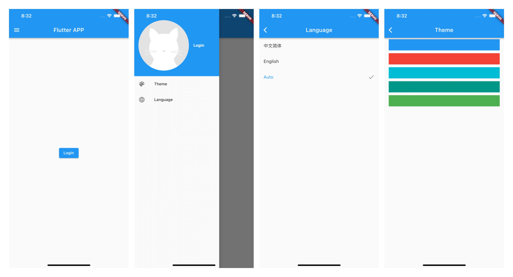
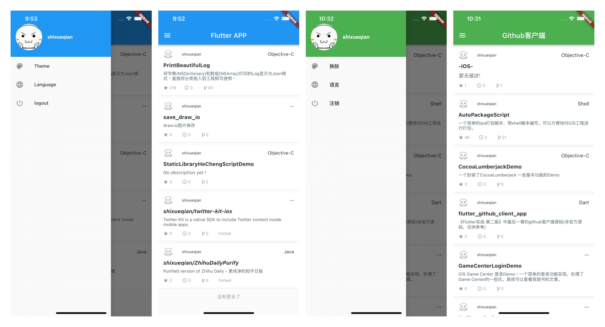

# flutter_github_client_app
[《Flutter实战·第二版》](https://book.flutterchina.club/chapter15/intro.html)中最后一章的github客户端源码(非官方源码，仅供参考)

## 使用
* 1.下载代码后在根目录执行 flutter package get 命令，下载对应的包
* 2.Android Studio上安装Intl插件

## 说明
目前《Flutter实战·第二版》目前没有看到源码。书中最后一章的完整项目有源码参考会更好。故将调试成功后的github客户端代码上传以供参考。
本项目基本上按照[《Flutter实战·第二版》](https://book.flutterchina.club/chapter15/intro.html)中最后一章的github客户端相关描述编写。

不同的地方：

1.国际化的方案同样是使用了Intl包，但是书上的方法太麻烦了，本项目是使用Intl插件来处理的，流程会简单很多。具体使用请参考[FunFlutter系列之国际化Intl方案](https://juejin.cn/post/6844903823119482888)

## 界面展示

